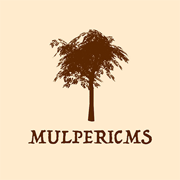

# WORK IN PROGRESS

MulperiCMS is a markdown blogging platform that includes following applications:

#### Client

Angular blogging app and editor for creating new posts.
To start development, use `npm start`.

#### Node.js REST API for DynamoDB

Server side application with endpoints that the client app use for communicating with the database. 

To run API locally, use `npm run dev`. You need `.env` file with AWS credentials. Use http://localhost:3000/ to access the endpoints.

You need to have `mulpericms-posts` table in your DynamoDB with primary key `id`.

#### Cognito notes
 "When creating the App, the generate client secret box must be unchecked because the JavaScript SDK doesn't support apps that have a client secret."

#### tsconfig.app.json notes
add compileroption -> "types": ["node"]

#### Verifying Cognito JWT
https://docs.aws.amazon.com/cognito/latest/developerguide/amazon-cognito-user-pools-using-tokens-verifying-a-jwt.html